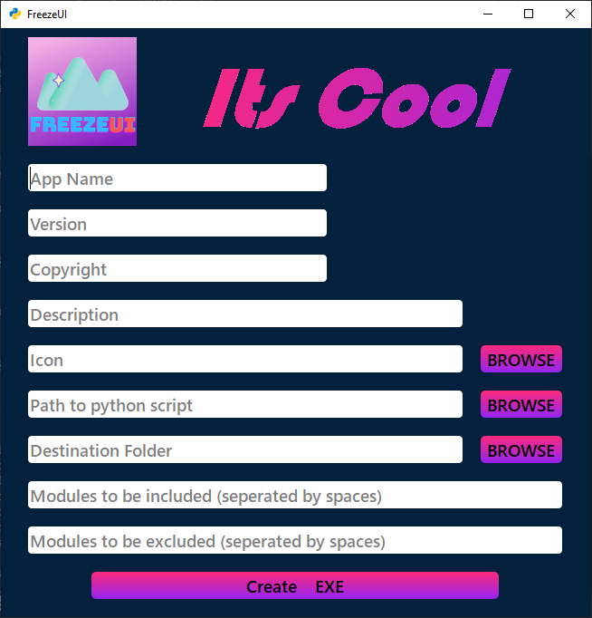
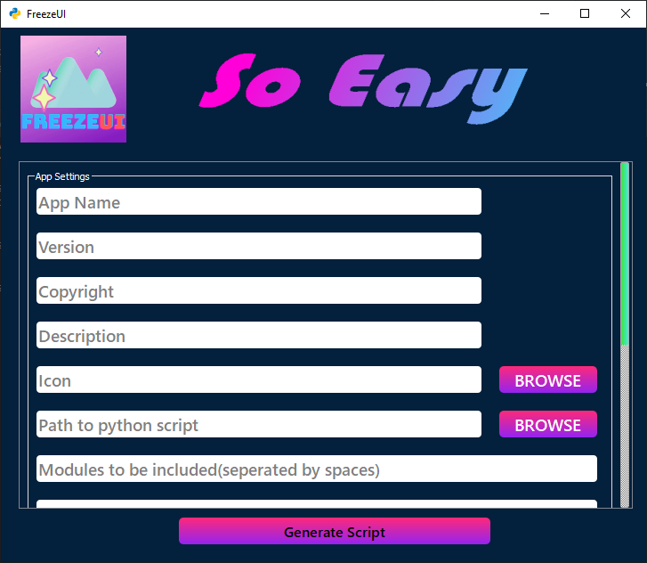
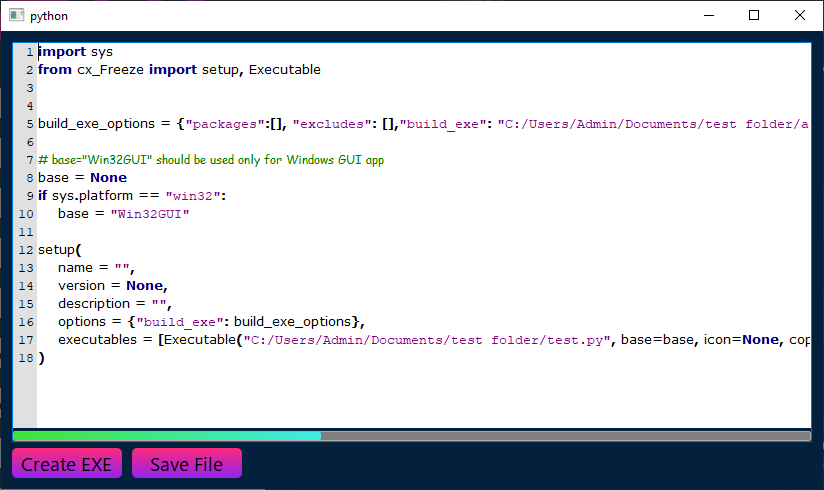

   

FreezeUI is a python package used to create [cx_Freeze](https://pypi.org/project/cx-Freeze/) setup files and run them to create applications.

Currently it can only make **Windows MSI and EXE**.
## Installation

```
pip install FreezeUI
```

---

## Build from source

To build from source download the [zip folder](https://github.com/AkshatChauhan18/FreezeUI/archive/refs/heads/master.zip) or use *git* to
clone repo using command : 

```
git clone https://github.com/AkshatChauhan18/FreezeUI <location>
```

After that from the folder run command

 ```
pip install -e .
``` 

Now you can contribute to FreezeUI project. You can run the above command whenever you make changes to ```setup.py``` or to the code.

---

## Usage

For creating **EXE** the command is

``` 
freezeui-exe
```

For creating **MSI** the command is

```
freezeui-msi
```

___

## Gallery

|Exe Window |Msi Window | 
| ----------- | ----------- | 
|||

|Editor Window|
| ----------- |
||


