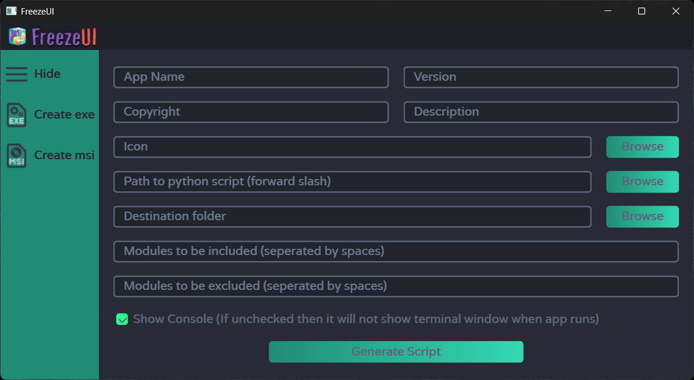
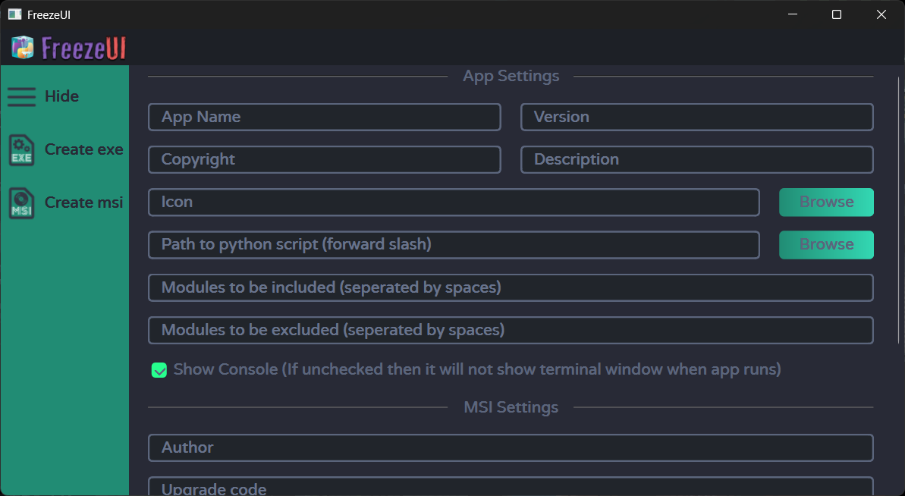
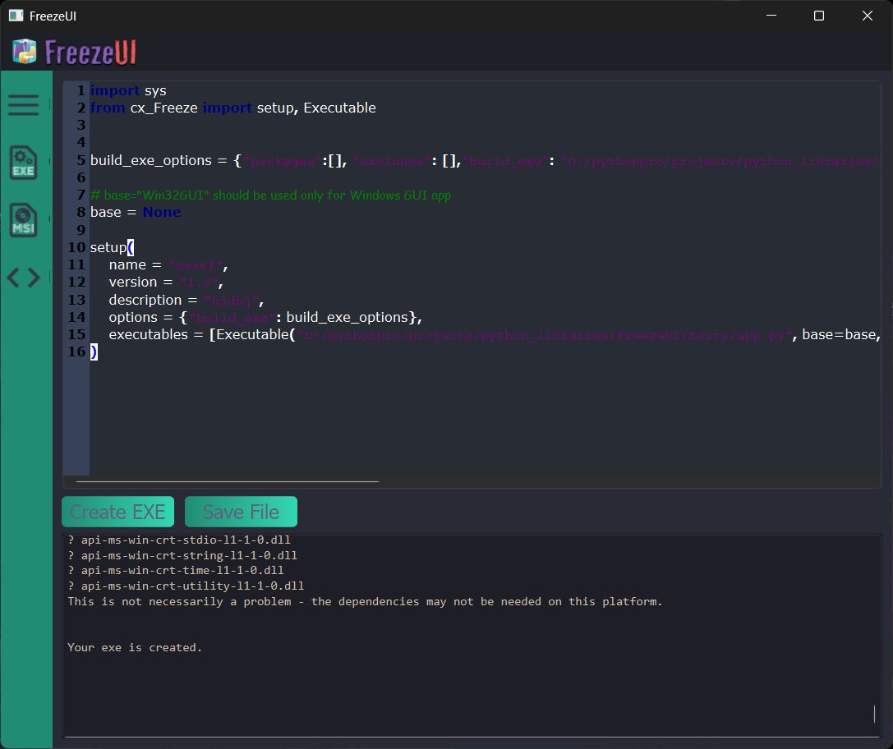

   

FreezeUI provides a simple graphical user interface (GUI) to convert `.py` files into Windows `.exe` applications or `.msi` installers using [cx_Freeze](https://pypi.org/project/cx-Freeze/) .

---
## Getting Started
### Prerequisites
- Python 3.9-3.13
### Installation using pip

```
pip install FreezeUI
```
---
### Installation via GitHub
```
git clone https://github.com/AkshatChauhan18/FreezeUI.git
cd FreezeUI
uv build
pip install .
```
### Usage

To use it run the following command in terminal:

```
freezeui
```
Then choose the options for your application,then you can edit the cx_freeze script in the editor if you want .After that click create button to make the exe or msi.

---

## Demo

### **Check demo videos [here](https://akshatchauhan18.github.io/FreezeUI/demo.html) .**

| <!-- -->                                                                                                                                             | <!-- -->                                                                                                                              |
| ---------------------------------------------------------------------------------------------------------------------------------------------------- | ------------------------------------------------------------------------------------------------------------------------------------- |
| [](https://raw.githubusercontent.com/AkshatChauhan18/FreezeUI/master/readme_assets/exe.png) | [](https://raw.githubusercontent.com/AkshatChauhan18/FreezeUI/master/readme_assets/msi.png) |
| [](https://raw.githubusercontent.com/AkshatChauhan18/FreezeUI/master/readme_assets/script%20editor.png) | [](https://raw.githubusercontent.com/AkshatChauhan18/FreezeUI/master/readme_assets/console.png)    |

---

## Benefit of using FreezeUI

In order to convert .py to .exe/.msi using cx_freeze you need to write extra setup python files which is time taking process. FreezeUI creates those setup files for you using GUI which is a easy process and later you can edit those files using FreezeUI editor.